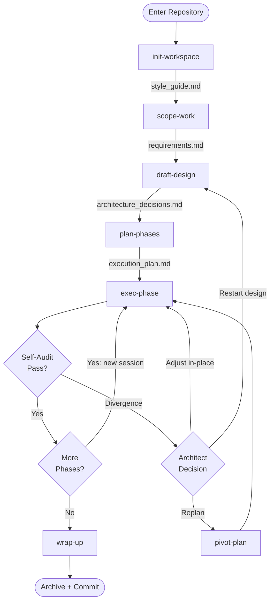
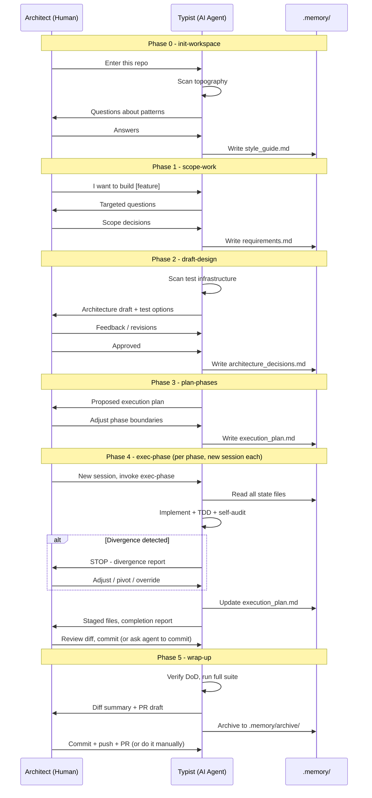
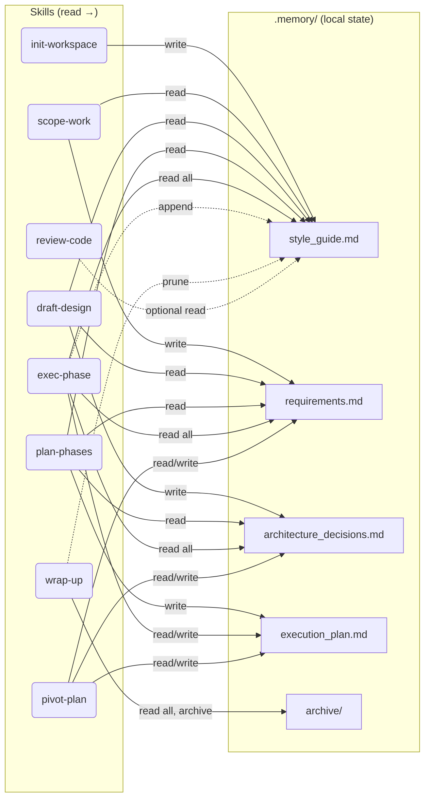
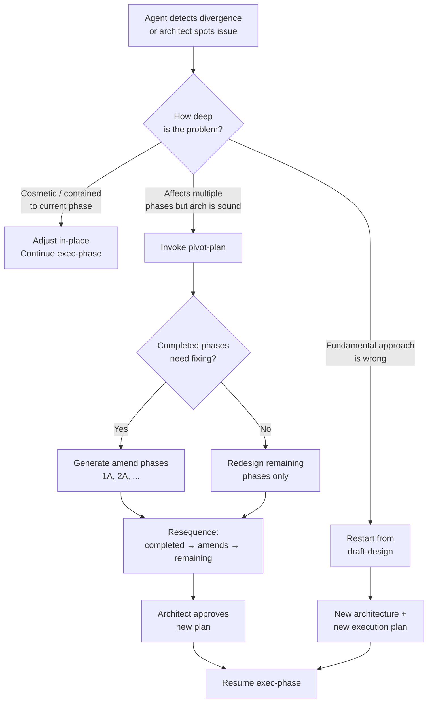

# The Architect-Typist Workflow

A disciplined, phased pipeline for building features with AI agents.
The human stays in the architect seat. The AI is the typist - fast,
capable, but never autonomous. All state is local, all decisions are
human, all commits are human-authorized.

Language-agnostic. Framework-agnostic. Tool-agnostic.

---

## Quick Start

### 1. Copy skills into your AI tool

**Claude Code:**
```bash
# Copy all skills to your user-level skills directory
cp -r skills/ ~/.claude/skills/architect-typist/
```

**OpenAI Codex CLI:**
```bash
# Codex uses instructions files - copy skills to your project
cp -r skills/ .codex/skills/
# Reference them in your codex instructions or load as context
```

**Any other agent (Cursor, Aider, etc.):**

The skills are plain markdown files. Load them as system prompts,
paste them into context, or reference them however your tool supports
persistent instructions. No tool-specific markup.

### 2. Start a session

```
> /init-workspace
```

The agent scans your repo, asks clarifying questions, and writes
`.memory/style_guide.md`. You're ready.

### 3. Follow the pipeline

```
init-workspace → scope-work → draft-design → plan-phases → exec-phase (repeat) → wrap-up
```

Each skill is a phase. Each phase produces a file in `.memory/`. Each
file feeds the next phase. The human approves at every gate.

---

## The Pipeline



> **`review-code`** is an independent skill - it can be invoked at any
> point, inside or outside the pipeline. It does not depend on
> `.memory/` state.

---

## Who Does What

The pipeline is a conversation between two roles. The boundary is
strict: the AI proposes, the human decides.



### Responsibility Matrix

| Action | Architect | Typist |
|--------|:---------:|:------:|
| Set direction and scope | **owns** | asks questions |
| Make architectural decisions | **owns** | proposes options |
| Approve designs and plans | **owns** | waits for approval |
| Write code | reviews | **owns** |
| Run tests and verification | reviews output | **owns** |
| Self-audit against the plan | reviews honestly | **owns** |
| Detect divergence and stop | can also catch | **owns** |
| Decide to pivot or continue | **owns** | recommends |
| Commit to version control | **owns** | only when asked |
| Push / create PR | **owns** | only when asked |

---

## .memory/ - The Shared Brain

All state lives in `.memory/` at the repository root. It's the
continuity mechanism across context window wipes, session restarts,
and even different AI tools.



### What gets committed?

| File | In Git? | Why |
|------|---------|-----|
| `style_guide.md` | **Yes** | Team-shared codebase knowledge |
| `requirements.md` | No | Archived locally per branch |
| `architecture_decisions.md` | No | Archived locally per branch |
| `execution_plan.md` | No | Ephemeral operational state |
| `archive/` | No | Human-readable history |

`.gitignore` entry:
```
.memory/*
!.memory/style_guide.md
```

---

## Skills Reference

| Skill | Purpose | Inputs | Outputs |
|-------|---------|--------|---------|
| [init-workspace](skills/init-workspace.md) | Enter repo, establish conventions | None | `style_guide.md` |
| [scope-work](skills/scope-work.md) | Define feature boundaries | `style_guide.md` | `requirements.md` |
| [draft-design](skills/draft-design.md) | Architecture + test strategy | `requirements.md`, `style_guide.md` | `architecture_decisions.md` |
| [plan-phases](skills/plan-phases.md) | Execution blueprint | All `.memory/` files | `execution_plan.md` |
| [exec-phase](skills/exec-phase.md) | Implement one phase | All `.memory/` files | Code + updated plan |
| [wrap-up](skills/wrap-up.md) | Close the cycle | All `.memory/` files | Archive + staged commit |
| [pivot-plan](skills/pivot-plan.md) | Replan mid-flight | All `.memory/` files | Updated plan + arch |
| [review-code](skills/review-code.md) | Standalone code review | None (style_guide optional) | Review report |

---

## Guardrails

These rules are embedded in the skills and enforced by the agent:

- **One phase at a time.** No parallel execution. Wait for human
  approval between phases.
- **3-Strike Rule.** If tests/build/lint fail 3 times, the agent
  stops, documents the error, and waits. No brute-forcing.
- **Honest Failure.** Declaring a phase FAILED is a success. Hiding
  mistakes is the actual failure.
- **Divergence Detection.** If the implementation drifts from the
  plan, the agent stops and reports. It never self-corrects silently.
- **Targeted staging.** Explicit file paths only. No `git add .`.
- **200-line style guide cap.** The style guide consolidates rather
  than growing unbounded.

### Action Authority

The agent distinguishes between autonomous actions (safe to do without
asking) and delegated actions (only when the architect explicitly
asks). The principle: **the agent never takes irreversible or
externally-visible actions on its own.**

| Action | Authority | Notes |
|--------|-----------|-------|
| Read files | Autonomous | Always safe |
| Write code to target files | Autonomous | Within the current phase only |
| Run build/test/lint | Autonomous | Verification is the agent's job |
| Stage files | Autonomous | After phase verification, explicit paths only |
| Append to style guide | Autonomous | Capped at 200 lines |
| Update execution plan | Autonomous | Status, audit, completion record |
| Commit | **Delegated** | Only when architect asks |
| Push | **Delegated** | Only when architect asks |
| Create PR | **Delegated** | Only when architect asks |
| Create/delete branches | **Delegated** | Only when architect asks |
| Modify files outside target list | **Prohibited** | Triggers divergence detection |
| Move to next phase without approval | **Prohibited** | Architect gates every phase |
| Self-correct a divergence silently | **Prohibited** | Must stop and report |
| Attempt a 4th fix after 3-Strike | **Prohibited** | Must stop and wait |

---

## Pivot Decision Tree

When something goes wrong mid-execution, this is the decision model:



---

## Example Session

See [docs/mock-session.md](docs/mock-session.md) for a complete
walkthrough of the pipeline applied to a real-world feature (adding
RBAC to a Spring Boot API). The mock session demonstrates:

- Full pipeline from init through wrap-up
- Multi-phase execution with context window management
- A mid-flight divergence caught by self-audit
- Style guide growing organically from discovered quirks

---

## Design Principles

### Why local state?

AI agents lose context. Chat windows close. Sessions expire. Token
limits truncate history. `.memory/` files are the answer: persistent,
readable, versionable state that survives all of these failure modes.
The agent rebuilds its understanding from files, not from conversation
history.

### Why phased execution?

Large features in a single AI session are fragile. Context windows
fill up. Errors compound. Debugging becomes archaeology. Phased
execution bounds the blast radius: each phase is independently
verifiable, and if something goes wrong, you lose one phase of work,
not all of it.

### Why human-gated?

AI agents are fast and capable but not accountable. They optimize for
completion, not correctness. Human gates at every phase boundary force
the architect to engage with the work - reviewing diffs, validating
decisions, catching what automated checks miss. The cost is minutes
per gate. The value is confidence in the output.

### Why honest failure?

Most agent workflows treat failure as something to recover from
automatically. This workflow treats failure as information. An agent
that stops and says "I'm stuck" is more valuable than one that
silently works around a problem and ships something that looks right
but isn't. The 3-Strike Rule, self-audit checklists, and divergence
detection exist to make failure safe, visible, and cheap.

---

## Project Structure

```
├── README.md              ← you are here
├── skills/                ← the 8 skills (plain markdown)
│   ├── init-workspace.md
│   ├── scope-work.md
│   ├── draft-design.md
│   ├── plan-phases.md
│   ├── exec-phase.md
│   ├── wrap-up.md
│   ├── pivot-plan.md
│   └── review-code.md
├── templates/             ← read-only .memory/ file templates
│   ├── README.md
│   ├── style_guide.md
│   ├── requirements.md
│   ├── architecture_decisions.md
│   └── execution_plan.md
├── docs/                  ← supporting documentation
│   └── mock-session.md
└── archive/               ← original draft files
```

---

## FAQ

**Can I skip phases?**
Yes. For trivial tasks, hand-write `requirements.md` and jump to
`plan-phases`. The skills are composable - they communicate through
files, not conversation. Skip what you don't need.

**Can I use this with multiple AI tools?**
Yes. The `.memory/` files are plain markdown. Start with Claude Code,
continue with Codex, review with Cursor. The state is tool-agnostic.

**What if the context window fills up mid-phase?**
Start a new session and re-invoke `exec-phase`. The agent reads
`.memory/` files to rebuild context. Conversation history is not the
continuity mechanism - files are.

**What if I disagree with the agent's self-audit?**
You are the architect. Override any assessment. The self-audit is a
tool for catching issues early, not a substitute for human judgment.

**Can a team share this workflow?**
Yes. The `style_guide.md` is committed to git and shared across the
team. Each developer's execution state (plans, requirements, archives)
stays local.
