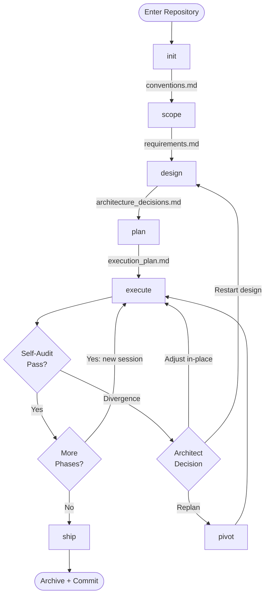
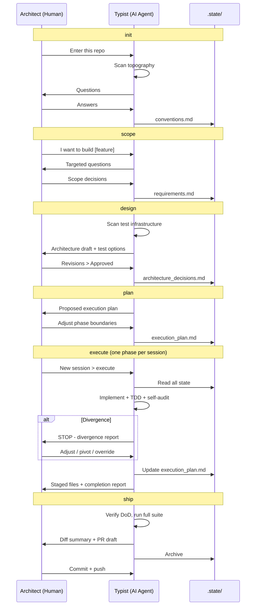
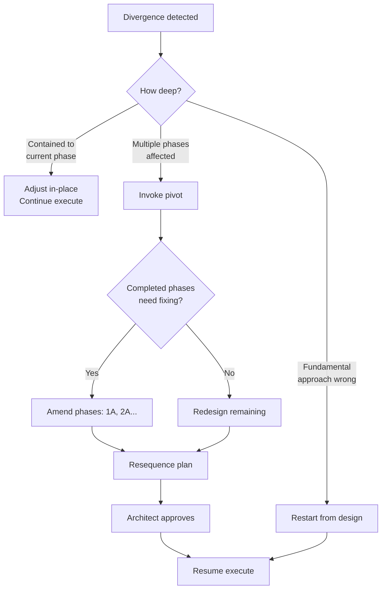

# The Architect-Typist Workflow

You decide. The AI builds.

A disciplined pipeline for shipping features with AI agents.
The human stays in the architect seat, setting direction, making
decisions, owning every commit. The AI is the typist: fast, capable,
but never in charge.

All state is local. All decisions are human. All commits are
human-authorized.

Language-agnostic. Framework-agnostic. Tool-agnostic.

---

## Why This Exists

AI agents are powerful but not accountable. They optimize for
completion, not correctness. Without structure, they silently drift
from the plan, skip edge cases, and ship code that looks right but
isn't.

This workflow fixes three failure modes:

**Context death.** Sessions expire. Windows close. Token limits
truncate history. `.state/` files survive all of it. The agent
rebuilds understanding from files, never from conversation memory.

**Compounding errors.** One large session is fragile. One mistake
cascades into everything after it. Phased execution bounds the
blast radius: each phase is independently verifiable. If something
breaks, you lose one phase of work, not all of it.

**Silent drift.** Agents don't stop when they're wrong. They work
around problems. Human gates at every phase boundary force
engagement with the actual output. Divergence detection makes
drift visible, cheap, and fixable.

---

## Quick Start

### 1. Add the skills

**Claude Code:**
```bash
cp skills/*.md ~/.claude/skills/
```

**Any other agent:**
The skills are plain markdown. Load them however your tool supports
persistent instructions: system prompts, context files, or paste.

### 2. Initialize

```
/init
```

The agent scans your repo, asks questions, writes
`.state/conventions.md`.

### 3. Build something

```
/scope for this task: add rate limiting to the API
```

Then follow the pipeline. One skill at a time. One approval at a time.

---

## The Pipeline

Fifteen skills. Seven form the core pipeline. Eight are utilities you
reach for when you need them.

```
init  →  scope  →  design  →  plan  →  execute  →  ship
                                   ↑
                             pivot (escape hatch)
```

Each pipeline skill reads from `.state/`, does its job, writes back
to `.state/`, and waits for the architect to approve before the next
skill runs.



### Pipeline Skills

| # | Skill | What it does | Produces |
|---|-------|-------------|----------|
| P1 | [init](skills/init.md) | Enter the repo, learn conventions | `conventions.md` |
| P2 | [scope](skills/scope.md) | Debate and define what to build | `requirements.md` |
| P3 | [design](skills/design.md) | Architect the solution, choose test strategy | `architecture_decisions.md` |
| P4 | [plan](skills/plan.md) | Break work into phased vertical slices | `execution_plan.md` |
| P5 | [execute](skills/execute.md) | Build one phase, verify, self-audit | Code + updated plan |
| P6 | [ship](skills/ship.md) | Verify DoD, archive state, prepare commit | Archive + staged changes |
| P7 | [pivot](skills/pivot.md) | Replan when direction changes | Updated planning state |

### Utility Skills

Use these anytime, inside or outside the pipeline.

| Skill | What it does |
|-------|-------------|
| [orient](skills/orient.md) | Get your bearings in an existing workspace |
| [fast](skills/fast.md) | Fast path for trivial tasks or exploratory spikes |
| [review](skills/review.md) | Independent code review with ranked findings |
| [estimate](skills/estimate.md) | Work effort estimate before planning |
| [triage](skills/triage.md) | Read-only incident triage and diagnosis |
| [artifacts](skills/artifacts.md) | Draft PRs, team updates, and documents |
| [forge](skills/forge.md) | Turn a rough skill idea into a proper skill |
| [maintain](skills/maintain.md) | Run structured maintenance on existing skills |

---

## How It Works

The pipeline is a conversation between two roles. The boundary is
strict.



### Who Owns What

| Action | Architect | Typist |
|--------|:---------:|:------:|
| Set direction and scope | **owns** | asks questions |
| Make architecture decisions | **owns** | proposes options |
| Approve designs and plans | **owns** | waits |
| Write code | reviews | **owns** |
| Run verification | reviews output | **owns** |
| Self-audit against the plan | reviews honestly | **owns** |
| Detect divergence and stop | can also catch | **owns** |
| Decide to pivot or continue | **owns** | recommends |
| Commit, push, create PR | **owns** | only when asked |

---

## .state/

Everything the agent needs to know lives in `.state/` at the repo
root. It survives context window wipes, session restarts, and tool
switches. The agent reads these files to rebuild understanding. It
never relies on conversation history.

| File | Written By | Read By | Purpose |
|------|------------|---------|---------|
| `resume.md` | Any skill | `orient`, then owning skill | Session handoff bookmark |
| `conventions.md` | `init` | All skills | Conventions and field notes |
| `requirements.md` | `scope` | `design` through `ship` | Approved scope and DoD |
| `architecture_decisions.md` | `design` | `plan` through `ship` | Approved technical design |
| `execution_plan.md` | `plan` | `execute`, `ship`, `pivot` | Phase-by-phase state |
| `estimate.md` | `estimate` | Human reference | Work effort snapshot |
| `maintain/` | `maintain` | `maintain` | Maintenance campaign memory |
| `archive/` | `ship` | Human reference | Completed work history |

### What Gets Committed

| File | Git? | Why |
|------|:----:|-----|
| `conventions.md` | **Yes** | Team-shared knowledge |
| `maintain/` | **Yes** | Repo-tracked maintenance memory |
| Everything else | No | Ephemeral or local-only |

```gitignore
.state/*
!.state/conventions.md
!.state/maintain/
!.state/maintain/**
```

---

## Guardrails

These aren't suggestions. They're embedded in the skills and enforced
by the agent.

**One phase at a time.** No parallel execution. The architect
approves before the next phase starts.

**3-Strike Rule.** Three consecutive test/build/lint failures and the
agent stops, documents the error, and waits. No brute-forcing.

**Honest Failure.** Declaring a phase FAILED is a success. The agent
caught the problem before it compounded. Hiding mistakes is the
actual failure.

**Divergence Detection.** If implementation drifts from the plan, the
agent stops and reports. It never self-corrects silently.

**Targeted Staging.** Explicit file paths only. No `git add .`.

**200-Line Conventions Cap.** The conventions file consolidates
rather than growing unbounded.

### Action Authority

| Action | Authority |
|--------|-----------|
| Read files | Autonomous |
| Write code to target files | Autonomous (current phase only) |
| Run build/test/lint | Autonomous |
| Stage files (explicit paths) | Autonomous |
| Append to conventions | Autonomous (200-line cap) |
| Update execution plan | Autonomous (status + audit) |
| Commit / Push / Create PR | **Delegated** (only when asked) |
| Create or delete branches | **Delegated** (only when asked) |
| Touch files outside target list | **Prohibited** (triggers divergence) |
| Advance to next phase | **Prohibited** (architect gates every phase) |
| Self-correct a divergence | **Prohibited** (must stop and report) |
| 4th fix attempt after 3-Strike | **Prohibited** (must stop and wait) |

---

## When Things Go Wrong



---

## Commands

### Core Pipeline

Run these in order. Each one feeds the next.

| Skill | Invocation | What happens |
|-------|-----------|-------------|
| `init` | `/init` | Scans repo, writes `conventions.md` |
| `scope` | `/scope for: [describe task]` | Debates scope, writes `requirements.md` |
| `design` | `/design` | Drafts architecture, writes `architecture_decisions.md` |
| `plan` | `/plan` | Breaks into phases, writes `execution_plan.md` |
| `execute` | `/execute` | Builds next pending phase (one per session) |
| `ship` | `/ship` | Verifies DoD, archives state, stages commit |
| `pivot` | `/pivot because [reason]` | Replans when direction changes |

### Utilities

Use anytime.

| Skill | Invocation | What happens |
|-------|-----------|-------------|
| `orient` | `/orient` | Reads `.state/`, reports where you are |
| `fast` | `/fast [task]` | Fast path for trivial tasks or spikes |
| `review` | `/review` | Reviews staged or specified diff |
| `estimate` | `/estimate [ask]` | Effort estimate before planning |
| `triage` | `/triage [symptom]` | Diagnoses an issue, read-only |
| `artifacts` | `/artifacts [type]` | Drafts a PR, update, or document |
| `forge` | `/forge on [draft]` | Audits and rewrites a rough skill |
| `maintain` | `/maintain on [feedback]` | Runs maintenance on existing skills |

### Habits

- Follow the pipeline in order.
- Run `/execute` repeatedly, one phase per session.
- Use `/pivot` instead of silently changing direction.
- Use `/orient` when returning to a repo with existing `.state/`.
- Use `/fast` for small tasks that don't need full planning.
- Use `/estimate` when uncertain whether a task is trivial or large.

---

## See It In Action

The [tech talk](docs/tech-talk/README.md) walks through the entire
pipeline on a real codebase
([bill-splitter](https://github.com/aakarshsingh/bill-splitter)).
Four features go from empty `.state/` to shipped PR, with mocked
outputs for every skill along the way.

What it covers:

- Every pipeline skill (init through ship) with full output artifacts
- Session resume: the architect steps away mid-project, returns hours
  later, and the agent picks up with zero context loss
- A near-divergence caught by self-audit and deferred to a later phase
- A post-execution pivot where the architect finds UX problems and the
  agent generates a surgical amend phase
- Field notes discovered, tracked, and resolved across phases

---

## FAQ

**Can I skip phases?**
Yes. Hand-write `requirements.md` and jump to `plan`. The skills
communicate through files, not conversation.

**When should I use `fast` instead of the full pipeline?**
Single bug fix, config change, narrow refactor, small test addition.
If it touches more than two files or needs a design decision, use the
pipeline.

**When should I use `estimate`?**
Before any task where you're unsure whether it's trivial or large.
Estimate first, then decide: fast path, spike, or full pipeline.

**Can I use multiple AI tools?**
Yes. `.state/` is plain markdown. Start with Claude, continue with
Cursor, finish with whatever. The files carry the state.

**Context window filled up?**
New session, re-invoke `execute`. The files are the continuity
mechanism.

**Disagree with the self-audit?**
You're the architect. Override anything.

**Team use?**
`conventions.md` is committed and shared. Execution state stays
local to each developer.

---

## Project Structure

```
README.md
docs/
  cheatsheet.md        Quick reference for all 15 skills
  tech-talk/           Full pipeline walkthrough with mocked outputs
skills/
  Pipeline
  init.md              P1  enter repo, learn conventions
  scope.md             P2  define what to build
  design.md            P3  architect the solution
  plan.md              P4  break into phases
  execute.md           P5  build one phase
  ship.md              P6  close the cycle
  pivot.md             P7  replan when needed

  Utilities
  orient.md                get your bearings
  fast.md                  fast path or spike
  review.md                code review
  estimate.md              work effort estimate
  triage.md                incident triage
  artifacts.md             draft PRs and updates
  forge.md                 create new skills
  maintain.md              improve existing skills
```
